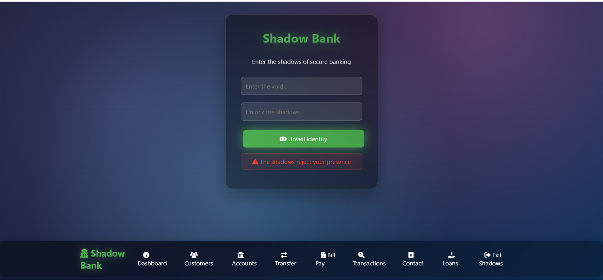

# Banking API Test Automation Framework



A comprehensive REST Assured test automation framework for Banking API with TestNG, Allure reporting, ExtentReports, schema validation, and extensive data-driven testing capabilities.

## 📞 Contact

Feel free to connect or follow:

- [👔 LinkedIn](https://www.linkedin.com/in/shady-ahmed97/)
- [💻 GitHub](https://github.com/shady1997)


## 🚀 Features

- **REST Assured** for API testing
- **TestNG** as test runner with parallel execution
- **Allure** and **ExtentReports** for detailed test reporting
- **JSON Schema Validation** for response validation
- **POJO Classes** for request/response mapping
- **Data-driven testing** with Excel and JSON support
- **Test retry mechanism** for flaky tests
- **Comprehensive logging** with Log4j2
- **Test listeners** for enhanced reporting
- **E2E test scenarios** covering complete workflows
- **Organized test suites** with XML configuration

## 📁 Project Structure

```
banking-api-test/
├── src/
│   ├── main/java/
│   └── test/java/
│       └── org/banking/
│           ├── base/
│           │   └── BaseTest.java
│           ├── dataproviders/
│           │   └── DataProviders.java
│           ├── dto/
│           │   ├── UserDto.java
│           │   ├── AccountDto.java
│           │   └── TransactionDto.java
│           ├── listeners/
│           │   ├── AllureTestListener.java
│           │   └── ExtentTestListener.java
│           ├── pojo/
│           │   ├── User.java
│           │   ├── Account.java
│           │   └── Transaction.java
│           ├── services/
│           │   ├── UserApiService.java
│           │   ├── AccountApiService.java
│           │   └── TransactionApiService.java
│           ├── tests/
│           │   ├── UserApiTests.java
│           │   ├── AccountApiTests.java
│           │   ├── TransactionApiTests.java
│           │   └── E2EApiTests.java
│           └── utils/
│               ├── ConfigReader.java
│               ├── RetryAnalyzer.java
│               ├── SchemaValidator.java
│               ├── JsonDataReader.java
│               └── ExcelDataReader.java
├── src/test/resources/
│   ├── schemas/
│   │   ├── user-schema.json
│   │   ├── account-schema.json
│   │   ├── transaction-schema.json
│   │   └── *-list-schema.json
│   ├── testdata/
│   │   ├── user-test-data.json
│   │   ├── user-test-data.xlsx
│   │   ├── account-test-data.xlsx
│   │   └── transaction-test-data.xlsx
│   ├── application.properties
│   ├── application-test.properties
│   └── log4j2.xml
├── testng.xml
├── user-api-suite.xml
├── account-api-suite.xml
├── transaction-api-suite.xml
├── e2e-suite.xml
├── smoke-suite.xml
├── regression-suite.xml
└── pom.xml
```

## 🛠️ Setup Instructions

### Prerequisites

- Java 17 or higher
- Maven 3.6+
- Banking API running on localhost:8080 (or configure endpoint in properties)

### Installation

1. Clone the repository:
```bash
git clone <repository-url>
cd banking-api-test
```

2. Install dependencies:
```bash
mvn clean compile
```

3. Update configuration in `src/test/resources/application.properties`:
```properties
base.url=http://localhost
base.port=8080
base.path=/banking
```

## 🚀 Running Tests

### Run All Tests
```bash
mvn clean test
```

### Run Specific Test Suite
```bash
# User API tests
mvn clean test -DsuiteXmlFile=user-api-suite.xml

# Account API tests
mvn clean test -DsuiteXmlFile=account-api-suite.xml

# Transaction API tests
mvn clean test -DsuiteXmlFile=transaction-api-suite.xml

# E2E tests
mvn clean test -DsuiteXmlFile=e2e-suite.xml

# Smoke tests
mvn clean test -DsuiteXmlFile=smoke-suite.xml

# Regression tests
mvn clean test -DsuiteXmlFile=regression-suite.xml
```

### Run with Different Environments
```bash
# Test environment
mvn clean test -Denv=test

# Staging environment
mvn clean test -Denv=staging

# Production environment
mvn clean test -Denv=production
```

### Run with Parallel Execution
```bash
mvn clean test -Dparallel=methods -DthreadCount=5
```

## 📊 Test Reports

### Allure Reports
```bash
# Generate Allure report
mvn allure:report

# Serve Allure report
mvn allure:serve
```

### ExtentReports
ExtentReports are automatically generated in `test-output/` directory after test execution.

### Test Logs
All logs are available in the `logs/` directory:
- `banking-api-tests.log` - All test logs
- `test-results.log` - Test execution results
- `api-calls.log` - API call details

## 🎯 Test Coverage

### User API Tests (`UserApiTests.java`)
- ✅ Create user with valid data
- ✅ Create user with invalid data (validation tests)
- ✅ Get user by ID
- ✅ Get non-existent user (404 test)
- ✅ Get all users
- ✅ Update user information
- ✅ Delete user
- ✅ Get user by username
- ✅ Create user from Excel data

### Account API Tests (`AccountApiTests.java`)
- ✅ Create account with valid data
- ✅ Create account with invalid data
- ✅ Get account by ID
- ✅ Get non-existent account
- ✅ Get all accounts
- ✅ Get accounts by user ID
- ✅ Update account information
- ✅ Delete account
- ✅ Get account by account number
- ✅ Create account from Excel data

### Transaction API Tests (`TransactionApiTests.java`)
- ✅ Create transaction with valid data
- ✅ Create transaction with invalid data
- ✅ Get transaction by ID
- ✅ Get non-existent transaction
- ✅ Get all transactions
- ✅ Get transactions by account ID
- ✅ Get transaction by reference number
- ✅ Create transaction from Excel data
- ✅ Transaction with insufficient funds

### E2E Tests (`E2EApiTests.java`)
- ✅ Complete user-account-transaction workflow
- ✅ User with multiple accounts and transactions
- ✅ Complete account lifecycle testing

## 🔧 Configuration

### Application Properties
Configure different environments using property files:
- `application.properties` - Base configuration
- `application-test.properties` - Test environment
- `application-staging.properties` - Staging environment
- `application-production.properties` - Production environment

### TestNG Configuration
- `testng.xml` - Main test suite configuration
- Individual suite files for organized test execution
- Parallel execution support
- Test grouping and filtering

### Schema Validation
JSON schemas are defined in `src/test/resources/schemas/` for:
- User response validation
- Account response validation
- Transaction response validation
- List response validation

### Test Data Management
- **JSON files** in `testdata/` for complex test scenarios
- **Excel files** for tabular test data
- **JavaFaker** for dynamic test data generation
- **Data providers** for parameterized testing

## 🔄 Test Retry Mechanism

Failed tests are automatically retried using `RetryAnalyzer`:
- Default retry count: 2
- Configurable via system property: `-Dretry.count=3`
- Detailed retry logging

## 📝 Test Listeners

### AllureTestListener
- Integrates with Allure reporting
- Captures test execution details
- Attaches failure information

### ExtentTestListener
- Generates ExtentReports
- Customizable report themes
- System information capture

## 🏷️ Test Groups and Tags

Tests are organized using TestNG groups:
- `@Test(groups = {"smoke"})` - Smoke tests
- `@Test(groups = {"regression"})` - Regression tests
- `@Test(groups = {"user-api"})` - User API specific tests
- `@Test(groups = {"account-api"})` - Account API specific tests
- `@Test(groups = {"transaction-api"})` - Transaction API specific tests
- `@Test(groups = {"e2e"})` - End-to-end tests

## 🐛 Debugging

### Enable Detailed Logging
```bash
mvn clean test -Dlogging.enabled=true
```

### Run Single Test Method
```bash
mvn clean test -Dtest=UserApiTests#testCreateUserWithValidData
```

### Skip Tests
```bash
mvn clean compile -DskipTests=true
```

## 🤝 Contributing

1. Fork the repository
2. Create a feature branch
3. Add tests for new functionality
4. Ensure all tests pass
5. Submit a pull request

## 📚 Documentation

For more detailed documentation:
- [TestNG Documentation](https://testng.org/doc/)
- [REST Assured Documentation](https://rest-assured.io/)
- [Allure Framework](https://docs.qameta.io/allure/)
- [ExtentReports](https://www.extentreports.com/)

## 🏆 Best Practices

1. **Test Independence** - Each test should be independent and not rely on other tests
2. **Data Management** - Use separate test data for each test case
3. **Assertions** - Use meaningful assertion messages
4. **Logging** - Include detailed logging for debugging
5. **Schema Validation** - Always validate response schemas
6. **Error Handling** - Test both positive and negative scenarios
7. **Test Organization** - Group related tests in suites
8. **Reporting** - Generate comprehensive test reports

## 📞 Support

For questions and support, please reach out to the development team or create an issue in the repository.

---

*Happy Testing! 🎉*